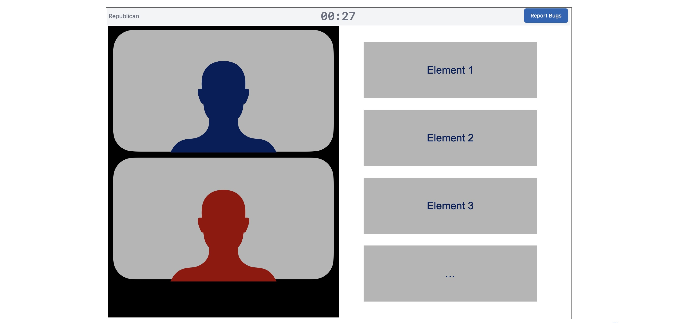
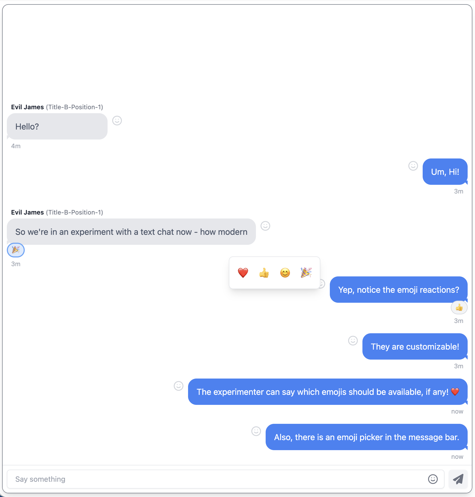

# Discussion Options

Discussion stages are the heart of most Deliberation Lab studies. This guide documents the `discussion` configuration object you can attach to any stage to enable synchronized text chat or video calls, along with optional breakout rooms and custom layouts.

Include the `discussion` block at the stage level, alongside `duration`, `elements`, etc.:

```yaml
gameStages:
  - name: Topic Discussion
    duration: 600
    discussion:
      chatType: video
      showNickname: true
      showTitle: false
    elements: ...
```

Discussion stages include the discussion interface (text chat or video call) in the left hand side of the window, and a display of elements (formatted in the same way as other stages) in the right-hand column.



### Universal Options

- **`chatType`** _(required)_: `"text"` or `"video"`.
- **`showNickname`** (default `true`): Display player nicknames. If false in text chat, displays player positions.
- **`showTitle`** (default `false`): Display player titles (if defined).
- **`showToPositions` / `hideFromPositions`**: Restrict which zero-based player indices see the discussion component at all (applies to both chat types). Invalid indices fail preflight validation.

## Text Chat (`chatType: "text"`)

Additional fields:

- **`reactionEmojisAvailable`**: Array of emojis participants can use for reactions and in text entry bar. Empty/omitted disables reactions.
- **`reactToSelf`** (default `true`): Allow reacting to your own messages.
- **`numReactionsPerMessage`** (default `1`): Maximum distinct reactions a single participant can add to one message.

Example:

```yaml
discussion:
  chatType: text
  showNickname: true
  reactionEmojisAvailable: ["❤️", "👍", "😊", "🎉"]
  reactToSelf: true
  numReactionsPerMessage: 1
```



---

## Video Chat (`chatType: "video"`)

The default videocall layout uses a responsive grid that adjusts the number of columns to maximize the size of each video. Positions on the screen are randomized, but the same for each participant, and consistent across disconnect/reconnect events. This is the option that most studies should use, unless you are specifically testing the effects of particular video call layouts.

Within this default, you can configure:

- **`showSelfView`** (Optional, default `true`): Hide/show the participant’s own tile.
- **`rooms`**: (Optional, defaults to include all participants). Define breakout rooms by listing which study positions (e.g. 0, 1, 2, ...) should be included in each room. If `rooms` is included, all players who are shown the discussion component (i.e., are included in `showToPositions` or excluded from `hideFromPositions`) must be assigned to exactly one room.

```yaml
discussion:
  chatType: video
  rooms:
    - includePositions: [0, 1]
    - includePositions: [2, 3]
```

### Custom Layouts

For fine-grained control, use `layout` in place of `rooms`. Each entry in the `layout` object is a key/value pair, where the value is an object that specifies what video streams or placeholder tiles will be displayed, and where, and the key is the experiment position (e.g. 0, 1, 2...) that they are shown to. This means you can define a different layout for each participant in the study, and control exactly which video an audio streams they observe, and how they are laid out.

The layout model uses a grid system. The `grid` element of each layout definition specifies the number of rows and columns to use in laying out video or placeholder tiles. You can use any number of grid cells, and then define display regions covering one or more rows and columns. This means you could do a 2x2 grid and display 4 participants in cells `[0, 0]`, `[0, 1]`, `[1, 0]`, `[1, 1]`, or do a 100x100 grid, and specify the region that each tile should be placed in using percentages - or something else entirely. Within the grid, display regions are zero-based and inclusive, and start in the top-left corner.

The `feeds` element of each layout definition includes a list of video and/or audio streams taken from particular participants, where in the grid to place them, and then the "z" order (i.e., what layer to place the streams in, with higher numbers being on top).

- `source` types can include either another `participant` or the participant themself: `self`. When the feed comes from another participant, indicate the `position` (e.g., 0, 1, 2...) that the stream is coming from.
- `displayRegion` objects contain an entry for `rows` and `columns`. These can take either a single integer, in which case they represent the single row/column that the tile is placed within, or they can take an object with keys `first` and `last`, indicating the first and last row or column included in the display region.

Layouts must be specified for all participants who are shown the discussion component (i.e., are included in `showToPositions` or excluded from `hideFromPositions`), but not all participants need to be displayed in any layout.

#### Example

The following example shows the participant at position `0` their own camera view picture-in-picture at the bottom center of the video call, with their partner (position `1`) taking up the full videocall window. To the participant assigned position `1` in the group, it shows a side-by-side layout with their partner (position 0) in the left half, and their self-view in the right half.

```yaml
discussion:
  chatType: video
  layout:
    0:
      grid:
        rows: 100
        cols: 100
      feeds:
        - source: { type: "participant", position: 1 }
          media: { audio: true, video: true }
          displayRegion:
            rows: { first: 0, last: 99 }
            cols: { first: 0, last: 99 }
          zOrder: 5
        - source: { type: "self" }
          media: { audio: false, video: true }
          displayRegion: # show self view picture-in-picture at the bottom center of the video call
            rows: { first: 45, last: 55 }
            cols: { first: 80, last: 99}
          zOrder: 10
    1:
      grid: {rows: 1, cols: 2}
      feeds:
        - source: { type: "participant", position: 0 }
          media: { audio: true, video: true }
          displayRegion: {rows: 0, cols: 0}
        - source: { type: "self" }
          media: { audio: false, video: true }
          displayRegion: {rows: 0, cols: 1}
      ...
```

## Common Patterns

- **Simple text chat**:

  ```yaml
  discussion:
    chatType: text
    showNickname: true
    showTitle: false
  ```

- **Video with hidden self view**:

  ```yaml
  discussion:
    chatType: video
    showSelfView: false
    showNickname: true
  ```

- **Text chat visible only to specific positions**:

  ```yaml
  discussion:
    chatType: text
    showToPositions: [0, 2]
    showNickname: true
  ```

Refer back to `treatment-overview.md` for how positions are assigned, and to `page-elements.md` for companion elements (prompts, timers, submit buttons) that commonly accompany a discussion stage.
