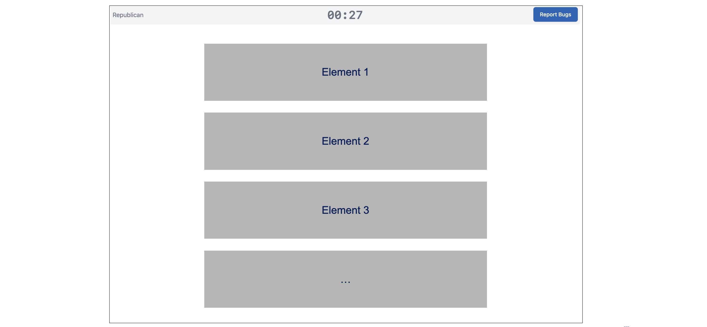
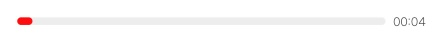

# Page Elements

Page elements are the building blocks of every stage. The `elements` array in a stage is rendered top‑to‑bottom as a single column; what you list first appears highest on the page.



There are a variety of different types of page elements, described with their syntax below. All elements accept the standard Empirica timing and visibility helpers:

- `name` - assign a label to any saved content or timing information associated with the element.
- `displayTime` / `hideTime` — Optional. Show or remove an element partway through the stage. Defaults to displaying for the full stage if unspecified.
- `showToPositions`, `hideFromPositions` — Optional. Limit an element to specific player positions: showToPositions will display only to player positions included in the list.
- `conditions` - an array of more complex conditions that allows items to be shown based on responses to other elements in the survey, participant attributes, etc. See [conditions](conditions.md)

Use these tools to choreograph multi-part screens without creating separate stages.

## Audio

Plays a single audio asset once per stage load. Provide `file` referencing a path in `deliberation-assets`. Note that browsers often require a prior user interaction before auto-playing audio. This shouldn't be a problem unless the participant refreshes the page and doesn't interact with it before the audio is supposed to play.

```yaml
- type: audio
  file: projects/example/audio/chime.mp3
```

## Display

Shows the response captured by another element (usually a prompt) as a styled blockquote. You can display anything accessible using the [Reference Syntax](reference-syntax.md), from any participant in the current game, in either prior stages or the current stage, but not (for obvious reasons) future stages.

```yaml
- type: display
  promptName: topicA_prompt
  position: shared
```

## Prompt

Renders a question or text from a prompt markdown file. To specify a prompt in the treatment manifest, prompts only need to know which Markdown file to load, a name that should be associated with any data collected by the prompt element, and a flag for whether responses are collected from each individual or the group as a whole. A typical element looks like:

```yaml
- type: prompt
  file: projects/example/prompts/topicA.md
  name: topicA_prompt # optional storage key
  shared: true # optional; write a single response shared across all participants that any participant can edit
```

See [Prompt Files](prompts.md) for explanations of the various types of prompt and the syntax for creating prompt markdown files.

## Qualtrics

This component embeds a Qualtrics survey inside an iframe in the current stage display. This is intended primarily as an escape hatch to allow study designers to use Qualtrics surveys to implement parts of the experiment that they Deliberation Lab does not yet support. Provide `url` and optional `params` (list of `{key, value}` objects). The component automatically appends `deliberationId` and `sampleId`, listens for the Qualtrics end-of-survey message, and records the session metadata. Completing the Qualtrics survey submits the stage, so no separate submit button is required.

In your qualtrics survey, make sure to either collect the deliberationId from the url parameter, or ask for participant's identifiers, so you can match data across platforms.

```yaml
- type: qualtrics
  url: https://upenn.qualtrics.com/jfe/form/SV_xxx
  params:
    - key: condition
      value: topicA
```

## Separator

Renders a horizontal rule to break up long pages. Set `style` to `thin`, `regular` (default), or `thick`.

```yaml
- type: separator
  style: thick
  testId: stage_break
```

## Submit Button

Adds a button participants can click when they are done with the stage.

When omitted, stages advance only when the timer expires (or you set `player.stage.set("submit", true)` via custom logic). You need to add a submit button to every intro or exit stage (or include a video or qualtrics survey) in order for the stage to advance.

```yaml
- type: submitButton
  buttonText: Continue # you can override the default button text ("Next")
  name: readiness_check # naming the button gives you stage submission timing
```

## Survey

Renders a survey exported from the `@watts-lab/surveys` package. Pass `surveyName` (matching an exported component) and, optionally, `name` to override the storage key.

```yaml
- type: survey
  surveyName: ExampleSurvey
  name: pre_discussion_example_survey
```

See [surveys](surveys.md) for a full list and description of survey elements.

## Timer

Displays a progress bar tied to stage time. Options:

- `startTime` / `endTime` – when the bar starts/stops counting (defaults to stage bounds).
- `warnTimeRemaining` – number of seconds before `endTime` when the bar turns red.

The timer respects `displayTime` and `hideTime`, so you can reveal it mid-stage.

```yaml
- type: timer
  startTime: 0
  endTime: 600
  warnTimeRemaining: 60
```



## Training Video

Embeds a synchronized YouTube (or compatible) video. Video time is tied to the stage time, and reconnecting participants jump to the time that matches the current stage clock. Submits the stage automatically when the video ends.

```yaml
- type: video
  url: https://youtu.be/QC8iQqtG0hg
```
