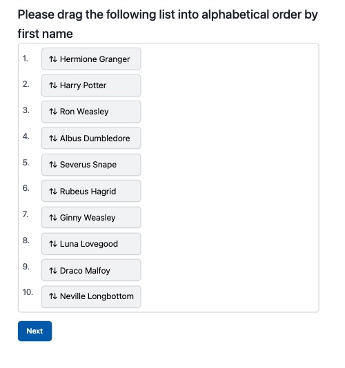

# Prompts

## General Structure

Prompts are specified as markdown files using [Commonmark](https://commonmark.org/help/) syntax with a [Github-Flavored Markdown](https://docs.github.com/en/get-started/writing-on-github/getting-started-with-writing-and-formatting-on-github/basic-writing-and-formatting-syntax) plugin.

Prompt files must have three sections, separated by lines containing exactly three dashes: (1) metadata, (2) display text, (3) response options.

For example:

```md
---
name: projects/example/multipleChoiceNumbers.md
type: multipleChoice
---

# What is the biggest number less than 7?

---

- 0
- 0.5
- 3
- 5.5
- six
- 7
- 8
```

### Metadata

Metadata is specified within the first section using YAML syntax. Required fields include:

- **name** (must match the path of the file relative to the repository root)
- **type** specifies what type of response is expected, values include:
  - noResponse: Only the display elements
  - multipleChoice: options will be formatted as radio buttons for single select
  - openResponse: a text entry box is provided
  - listSorter: options will be formatted for drag-and-drop reordering
  - slider: a slider control is provided with customizable tick marks and labels

### Display text

Any markdown-formatted content in this section (e.g., text, lists, tables, images) is displayed to the user. The only thing you can't use from normal markdown syntax is three hyphens (`---`) to specify a horizontal line.

Display text can include images, but they must be refered to by the path to the root of the assets folder, e.g. ``.

### Response options

- `multipleChoice`, `slider`, and `listSorter` options should use markdown list syntax starting with dashes `-`
- `openResponse` options should be prepended with a markdown quote format, using a `>` character

## Prompt types

### List Sorter

The list-sorter presents participants with a list of options that they can drag and drop into any order they wish. This is useful for prioritization and ranking tasks.

Example:

```md
---
name: example/listSorter.md
type: listSorter
---

## Please drag the following list into alphabetical order by first name

---

- Hermione Granger
- Harry Potter
- Ron Weasley
- Albus Dumbledore
- Severus Snape
- Rubeus Hagrid
- Ginny Weasley
- Luna Lovegood
- Draco Malfoy
- Neville Longbottom
```



### Multiple Choice

Prompts can be structured as multiple choice questions by setting the type to `multipleChoice`.

You can set several metadata flags to change the behavior of the question:

- `select` [`single` (default) or `multiple`] - force participants to select a single option (i.e., radio buttons) or allow them to select more than one option (i.e., checkboxes)
- `shuffleOptions` [`true`, `false` (default)] will randomize the order of the response options before displaying them to participants, storing the displayed order with the data

Example:

```md
---
name: example/multipleChoice.md
type: multipleChoice
---

## Which of the following wizards appears in the most novels?

---

- Dr. Strange
- Eskarina Smith
- Merlin
- Harry Dresden
- Gandalf
- Ged/Sparrowhawk
- Thomas Edison
- Albus Dumbledore
- Ponder Stibbons
```


### Open Response

Prompts can be structured as open response questions by setting the type to `openResponse`

You can set several metadata flags to change the behavior of the question:

- `rows` [positive integer, e.g. 5] will make the response box 5 (or other specified number) lines tall.
- `minLength` [positive integer] will display a character counter showing progress toward the minimum required characters (e.g., "(25 / 50+ characters required)") This only influences the display, you need to check for minimum length as a condition on stage submission if you want to enforce the minimum length. Character counters appear in the lower right corner of the text area and update in real-time
- `maxLength` [positive integer] will display a character counter showing remaining characters allowed (e.g., "(125 / 200 chars max)") This will enforce the cap, and not allow more characters to be entered.
- When both `minLength` and `maxLength` are specified, displays as "(current / min-max chars)" format

Example:

```md
---
name: projects/example/testMinLengthOnly.md
type: openResponse
rows: 4
minLength: 50
maxLength: 200
---

# Test Character Counter

Please write a response that is between 50 and 200 characters.

---

> Please enter your response here.
```


### slider

- `min: 0` (required) - minimum value of the slider
- `max: 100` (required) - maximum value of the slider
- `interval: 1` (required) - step size for the slider (must satisfy: min + interval <= max)
- `labelPts: [0, 20, 50, 80, 100]` (optional) - array of values where tick marks and labels should appear. If not specified, labels will be evenly spaced across the slider range.
- When `labelPts` is specified, the number of entries must match the number of labels in the response section
- The slider initially appears without a thumb to avoid anchoring effects. When the user clicks on the slider bar, a value is set and the thumb appears
- Labels are centered under their corresponding tick marks with intelligent text wrapping

Example:

```md
---
name: projects/example/sliderExample.md
type: slider
min: 0
max: 100
interval: 1
labelPts: [0, 20, 50, 80, 100]
---

# How warm is your love for avocados?

---

- Very cold
- Chilly
- Tolerable
- Warm
- Super Hot
```


