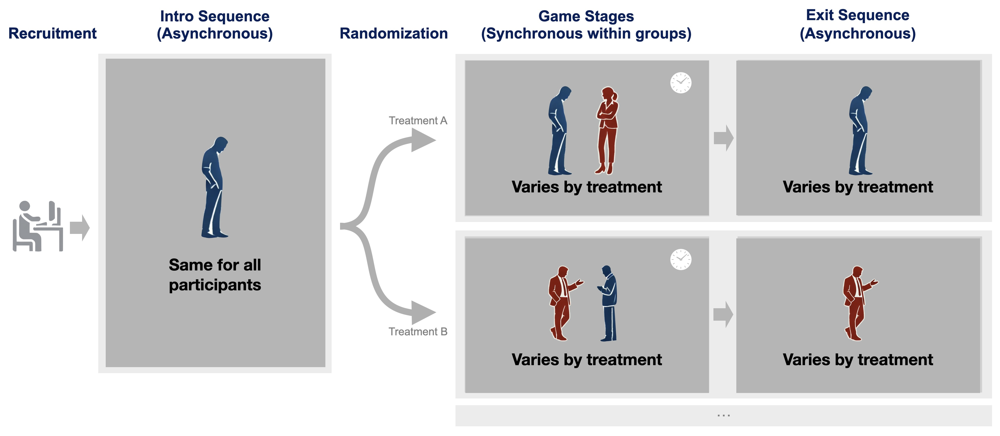

## Experiment Lifecycle and Implementation

Each Deliberation Lab study follows a three-part structure that moves participants from onboarding, through live interaction, to debriefing. These sections correspond to distinct elements in the **treatments manifest** and can be customized to fit your research goals.

The **treatments manifest** is a YAML file (with the extension `.treatments.yaml`) that defines the orchestration of an experiment. It specifies _when_ and _to whom_ different elements are displayed, under what conditions, and in what sequence—but not the content itself. Content such as prompts, instructions, and surveys are written separately in Markdown files and referenced within the manifest. Each manifest can include one or more **intro sequences** and **treatments**, which together describe the full experimental flow.

A **treatment** defines a deterministic path through the experiment after randomization. Treatments are defined at the level of the **group**—the set of participants who move through the experiment simultaneously. Members of a group may interact directly (for example, in conversation) or indirectly (by viewing or responding to one another’s input). A group might consist of two participants paired for a one-on-one discussion, or a larger group—such as four participants—who each have a series of three dyadic conversations with different partners. In all cases, the treatment specifies the coordinated path that each participant follows through the study once randomization occurs.

When players are assigned to a group, Deliberation Lab assigns each of them a **zero-based position index** (`0`, `1`, `2`, …). You can reference these positions in stage or element definitions—through `showToPositions`, `hideFromPositions`, discussion breakouts, or other configuration fields—to tailor the experience for specific participants. For example, if you want only the first player in a duo to see a particular prompt, set `showToPositions: [0]`. These indices stay consistent for the entire treatment, giving you fine-grained control over what each participant sees.

---

### 1. Intro Sequence (asynchronous, pre-randomization)

The intro sequence is completed individually before randomization and is shared across all treatments within a batch. It typically includes:

- **Standardized onboarding** — consent, system setup (camera/mic checks), and nickname selection.
- **Experiment-specific materials** — researcher-defined surveys, prompts, or videos completed at each participant’s pace.

In the treatments manifest, intro sequences are defined in their own section. You can define multiple intro sequences across your project, but each batch can include only one, since randomization has not yet occurred.

---

### 2. Game Section (synchronous, post-randomization)

The “game” is the live portion of the study—so named because all participants move through the same stages simultaneously. Each treatment defines a unique pathway through these stages. You can:

- Host one or more **video- or text-based conversations** with the full group or subsets.
- Insert **survey or prompt stages** between conversations.
- Show different content to different participants within the same stage.
- Include **submit buttons** so participants can proceed early, or let the stage advance automatically when the timer expires.

This structure allows precise control over timing, visibility, and synchronization while supporting a wide range of experimental manipulations.

---

### 3. Exit Sequence (asynchronous, post-game)

After the live stages, participants complete an exit sequence at their own pace. These untimed stages are typically used for:

- Post-conversation surveys or follow-up prompts.
- Quality control checks.
- Debriefing and closing messages (e.g., payment codes).

Because exit sequences occur after randomization, they are defined within each treatment in the manifest. This allows different conditions to have distinct exit flows, giving each treatment a complete and deterministic path from start to finish.

---

### Summary Diagram



---

### Example: Simple Two-Player Demo

The following example shows a minimal `.treatments.yaml` file defining an entire study. It includes one **intro sequence**, one **treatment**, a single **game stage**, and a short **exit survey**.

```yaml
introSequences:
  - name: default
    introSteps:
      - name: Intro
        elements:
          - type: prompt
            file: demo/simple_demo/intro/introduction.md
          - type: submitButton

treatments:
  - name: simple_demo
    desc: 2 player demo
    playerCount: 2

    gameStages:
      - name: discussion
        duration: 300
        discussion:
          chatType: video
          showNickname: true
          showTitle: false
        elements:
          - type: prompt
            file: demo/simple_demo/game/discussion_prompt.md
          - type: submitButton
            buttonText: Leave Discussion

    exitSequence:
      - name: post_survey
        elements:
          - name: exit_question
            type: prompt
            file: demo/simple_demo/exit/exit_question.md
          - type: submitButton
            buttonText: Submit Survey
```

#### How It Works:

- **introSequences** — This section contains the sequence or stages that participants see before randomization.

  - Here we show a single sequence (named `default`) with a single step (named `Intro`).
  - This step shows a single Markdown file (`introduction.md`) and a submit button.
  - We could include additional elements within each step, or additional steps after `Intro`.

- **treatements** — This section contains all the pathways that participants may encounter after randomization.

  - This file defines one treatment condition, `simple_demo`, with 2 "players" (participants), defined in `playerCount`.

  - **gameStages**

    - The treatment contains a single synchronous stage, called `Discussion`, which lasts for 5 minutes, or until both players click a `submitButton`.
    - During their conversation, players see their each other's nicknames displayed, but are not given any "Title". They also see a prompt defined in `discussion_prompt.md`

  - **Exit Sequence** — Asynchronous follow-up after the live session.
    - This exit sequence contains a single stage that displays a final survey prompt (`exit_question.md`) and names it for future reference
    - When participants complete these stages, they move to the standard Quality Control survey and debriefing.

This simple demo illustrates how the YAML structure maps directly onto the **experiment lifecycle**:

1. The **intro sequence** occurs before randomization.
2. The **game stage** defines the live interaction.
3. The **exit sequence** concludes the study asynchronously.

Even though the example is minimal, the same structure scales to complex multi-stage or multi-treatment experiments.
